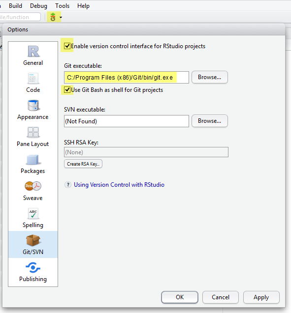
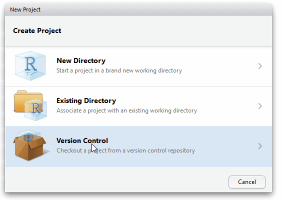

# Introduction how to use git with R and RStudio

This tutorial in the context of the **Reproducible Research Workshop** provides you with the first steps on how to use git with R and RStudio.

The repository provides you with a step by step tutorial, that you are reading right now and is at the same time the repository you _play_ with to create your first git project in R.

## Motivation

R in combination with the distributed version control system _Git_ provides a convenient setup to make your research project reproducible. Git allows you to track and share your code and analysis. 

Some reasons to use version control are:

* It makes sharing of your projects _easy_ (once it's setup, you'll get there)
* It facilitates collaboration. People can contribute to your project and vis-versa. Also you can report errors (bugs) or suggest new additions (features).
* You can revert back to a previous version, if you find errors or accidently deleted something.
* You can _see_ what changes between different version of your code, analysis or written text!
* In R it makes sharing of your packages easy. And you can install development packages of others with two lines of code. `install.packages("devtools"); devtools::install_github("username/packagename")` (Development of R packages is more advanced in R, but is a well structured well to keep your projects tidy see: [R Packages by Hadley Wickahm](http://r-pkgs.had.co.nz/))

[Github](https://github.com/) is a user-friendly webservice that allows you to store your project repository remotely. Alternatives are [gitlab](https://about.gitlab.com/) and [bitbucket](https://bitbucket.org/).

RStudio integrates support for git and svn, hence we are going to use the widely used combination _R + Git + RStudio_.

## Part 1: Installation and setup

To get started you need the following software installed on your computer:

**Git**  

* [Git](https://git-scm.com) ([Download Git](https://git-scm.com/downloads)). 
* Optional Git clients: [SourceTree](https://www.sourcetreeapp.com) or [GitHub Desktop](https://desktop.github.com) (use with care).

**R + RStudio**: If your are new to R you additionally have to install R and RStudio. Check if your current R + RStudio installation is up to date.

* [R](https://www.r-project.org) ([Download R](https://cloud.r-project.org))
* [Rstudio](https://www.rstudio.com) ([Download RStudio Desktop](https://www.rstudio.com/products/RStudio/#Desktop))

**GitHub**: On [Github](https://github.com/) create yourself a free GitHub account.    
If you haven't already followed the GitHub introduction to Git, follow the 15 min tutorial to get a quick interactive tutorial on Git. [TryGit Tutorial](https://try.github.io)

### Setup Git in RStudio

Tell RStudio where to find the Git installation

* Open RStudio and go to _Tools > Global Options..._ click on _Git/SVN_
* Check _Enable version control interface for RStudio projects_
* Set the path to the Git executable, that you just installed.



### Git setup

Configure Git and set your _user name_ and _email_ (The email address you used to register on GitHub). You can directly open the Git prompt from within RStudio. user name and email needs to be set only once.
Go to _Tools > Shell_ to open the Git Shell to tell Git your username and GitHub email.

```
git config --global user.name 'janedoe'
git config --global user.email 'jane.doe@geo.uzh.ch'
```


## Part 2: Create a new RStudio project with Git

There are two ways to create version control for a RStudio project. That is either to create a new project in a directory that is already under Git Version control or to create a new project based on a remote Git repository. 

1. **Create a new project from a folder under version control:** In this case you only need to create new RStudio project for that directory and version control is automatically enabled. Go to _File > New Project_, select create a new project from an _Existing Directory_ and create the project.
2. **Create a new project based on a remote Git repository:** Select _File > New Project.._ and from the opening menu select to create a new project from _Version Control_, Choose Git, then provide the repository url (use the https link of the url if you want to avoid all the ssh trouble) from the the repository you want to clone and create the project.

In this tutorial we create a project based on a remote repository. The repository we want to clone and use for our project is this one: https://github.com/314a/rr-rstudio-git . 

Step 1. Open the website of that GitHub repository and copy the HTTPS link of the project: https://github.com/314a/rr-rstudio-git . You find the HTTPS link (`https://github.com/314a/rr-rstudio-git.git`) on the right side of the GitHub project page (see Figure) 

Step 2. In RStudio Select _File > New Project.._, select _Version Control_, Choose _Git_, then provide the repository HTTPS link, select the R workspace folder and create the project. RStudio now copies (clones in Git terms) the content of the repository to your project folder. 

## Part 3: Fork a repository or create an own repository from a cloned repository

Forking a project allows you to clone a repository on server-side and make it the starting point of your own project. A _fork_ creates a personal copy of another repository. (See also the [Github Forking guide](https://guides.github.com/activities/forking/))


You may already have a cloned project (like in this tutorial), or want to fork your own project (which Github interestingly doesn't provide the options to do so). In this case you need to clone the project and push it to a new repository you have created.

Step 1. Create a new GitHub repository and copy the HTTPS url of the new repository.  

Step 2. Open the Git shell from RStudio _Tools > Shell.._ and type the following commands to change the url of the remote repository of the current project from `https://github.com/314a/rr-rstudio-git` to the new url e.g. `https://github.com/janedoe/rr-rstudio-git-mine.git`.

Type `git remote -v show` to show current remote repository to very the location of the current repository.

```
git remote set-url origin https://github.com/janedoe/rr-rstudio-git-mine.git
git remote add upstream https://github.com/janedoe/rr-rstudio-git-mine.git
git push origin master
git push --all
```

Note: In case push/pull is greyed out in R [stackoverflow](http://stackoverflow.com/questions/10298291/cannot-push-to-github-keeps-saying-need-merge
) use `git push -f origin master` and then `git push -u origin master`.

Note 2: Use `git remote rm origin` and `git remote rm upstream` if you want to remove the remote location from the current git folder. (origin is rather a convention than a command)


## Spell checking

https://support.rstudio.com/hc/en-us/articles/200551916-Spelling-Dictionaries
https://pages.github.com/

## Recommended literature

[1] L. Brundsdon, Chris; Comber, An Introduction to R for Spatial Analysis & Mapping. London: Sage Publications Ltd, 2015.    
[2] J. Paulson, “Version Control with Git and SVN,” 2016. [Online]. Available: https://support.rstudio.com/hc/en-us/articles/200532077-Version-Control-with-Git-and-SVN.   
[3] H. Wickham, “Git and GitHub,” R packages, 2015. [Online]. Available: http://r-pkgs.had.co.nz/git.html.    
[4] www.codeschool.com, “tryGit Tutorial.” [Online]. Available: https://try.github.io.
[5] K. Broman, “git/github guid.” [Online]. Available: http://kbroman.org/github_tutorial/.    