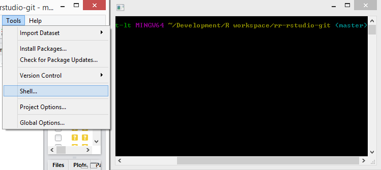
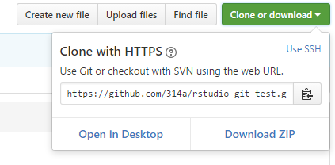

# How to use Git with R and RStudio

This tutorial in the context of the **Reproducible Research Workshop** provides you with the first steps on how to use git with R and RStudio.

The repository provides you with a step by step tutorial, that you are reading right now and is at the same time the repository you _play_ with to create your first git project in R.

**Objectives of this tutorial:**

* Setup and install Git 
* Setup Git in RStudio
* Create new Git project in RStudio
* Clone/fork an existing project from Github
* Make some commits to your own project.


## Motivation

R in combination with the distributed version control system _Git_ provides a convenient setup to make your research project reproducible. Git allows you to track and share your code and analysis. 

Some reasons to use version control are:

* It makes sharing of your projects _easy_ (once it's setup, you'll get there)
* It facilitates collaboration. People can contribute to your project and vis-versa. Also you can report errors (bugs) or suggest new additions (features) to projects.
* You can revert back to a previous version, if you find errors or accidently deleted something.
* You can _see_ what changes between different versions of your code, analysis or written text!
* In R it makes sharing of your packages easy. And you can install development packages of others with two lines of code. `install.packages("devtools"); devtools::install_github("username/packagename")` (Development of R packages is more advanced in R, but is a well structured well to keep your projects tidy see: [R Packages by Hadley Wickahm](http://r-pkgs.had.co.nz/))

[Github](https://github.com/) is a user-friendly webservice that allows you to store your project repository remotely. Alternatives are [gitlab](https://about.gitlab.com/) and [bitbucket](https://bitbucket.org/).

RStudio integrates support for git and svn, hence we are going to use the widely used combination _R + Git + RStudio_.

## Part 1: Installation and setup

To get started you need the following software installed on your computer: [Git](https://git-scm.com) and if you you are new to R, then you also need to install [R](https://www.r-project.org) and [Rstudio](https://www.rstudio.com). Additionally you will also need a [Github](https://github.com/) account.

1. **Git ([Download Git](https://git-scm.com/downloads)):** Download and Install Git . 
   _Optional Git clients: [SourceTree](https://www.sourcetreeapp.com) or [GitHub Desktop](https://desktop.github.com)_.
2. **R ([Download R](https://cloud.r-project.org)):** Download and Install R (if not already installed).
3. **RStudio ([Download RStudio Desktop](https://www.rstudio.com/products/RStudio/#Desktop)):**  Download and Install RStudio (if not already installed) 
4. **GitHub account**: On [Github](https://github.com/) create yourself a free GitHub account. _If you you are new to Git follow the 15 min [TryGit Tutorial](https://try.github.io) to get a quick introduction to Git._ 

### Setup Git in RStudio

Tell RStudio where to find the Git installation (see Figure 1).

1. Open RStudio and go to _Tools > Global Options..._ click on _Git/SVN_ 
2. **Check** _Enable version control interface for RStudio projects_
3. **Set the path to the Git executable**, that you just installed. Open a shell, if you don't know where Git is installed.    
   Windows: type `where git` and hit enter. The path should be something like: `C:/Program Files (x86)/Git/bin/git.exe`    
   Linux/OS X: type `which git` and hit enter. The path should be something like: `/usr/bin/git` 
4. **Restart RStudio**, if it worked out you will find the Git icon on the top toolbar (see Figure 1).


### Setup Git

Configure Git and set your _user name_ and _email_ (The email address you used to register on GitHub). You can directly open the Git prompt from within RStudio. User name and email needs to be set only once.
Go to _Tools > Shell_ to open the Git Shell to tell Git your username and GitHub email (!).

```git
git config --global user.name 'yourusername'
git config --global user.email 'user.name@provider.com'
```



## Part 2: Create a new RStudio project with Git

There are three ways to create version control for a RStudio project.

a) **Create a new project and create a local git repository:** Select _File > New Project.._, create a project from a _New Directory_ and check the option _Create a git repository_. In order to push to a remote repository later on you add that remote repository by using the Git shell. If you already know which online repository you want to use for your projects, option c) is more convenient.    

b) **Create a new project from a folder under version control:** In this case you only need to create new RStudio project for that directory and version control is automatically enabled. Go to _File > New Project_, select create a new project from an _Existing Directory_ and create the project.    

c) **Create a new project based on a remote Git repository:** Select _File > New Project.._ and from the opening menu select to create a new project from _Version Control_, Choose Git, then provide the repository url (use the https link of the url if you want to avoid all the ssh trouble) from the the repository you want to clone and create the project.

In this tutorial we create a project based on a remote GitHub repository (c). Hence we first create a new repository on github and create our github project from that repository.  

### Create a new GitHub repository

Login to your GitHub account and [create a new GitHub repository](https://github.com/new). Give your new repository a short and memmorable name e.g. `rstudio-git-test`, check the option to initialize this repository with a README and create the repository (see Figure 3).  

 

To create a new Git based project in RStudio we need the repository url. You find the repository HTTPS url on the just created GitHub project page. There press the button _Clone or download_ and copy the HTTPS link of the project (see Figure 4). The link will be something like `https://github.com/yourusername/rstudio-git-test.git`. 



### Create a new RStudio project with Git version control

Now everything is ready to create a new project with Git version control in RStudio. In RStudio Select _File > New Project.._, select _Version Control_, Choose _Git_, then provide the repository HTTPS link, select the R workspace folder and create the project. RStudio now copies (_clone_ in Git terms) the content of the repository to your project folder. The content of the GitHub repository should now appear in the Files pane of RStudio and you should see there the created `README.md`.


## Part 3: Make local changes, commit and push to GitHub

**1. Make local changes:** Open the `README.md` file and edit and save the file. 
```md
# RR project in RStudio
RR workshop RStudio + Git repository

My first commit to GitHub with R
```

**2. Commit the changes:** Now we commit the local changes to the local Git repository.    
In RStudio press the _Git_ icon and select _Commit.._ from Git menu (Ctrl+Alt+M) to open the commit window to review the changes in the repository. In the _Staged_ column we select by checking the checkbox the files we want to commit. The lower pane shows the edits in green and red of the file (see Figure 6). Enter a commit message to indicate what has changed in this commit e.g.`Readme update` and press the _Commit_ button. 

   

**3. Push to the remote repository:** To push the changes to the remote GitHub repository press the _Push_ button on the upper right corner of the commit window. You will be prompted to enter the username and password of your GitHub account, enter them and check on the GitHub page if the changes got pushed to your online repository on GitHub.

Now that you successfully pushed your first edits to a remote repository, repeat the above steps with a further file or R script that you create and edit, such as for instance the one below.

```R
# Simple R file
# R example data.frame "cars"
str(cars)     # show the structure
summary(cars) # summary of the variables
plot(cars)    # plot speed against distance
```

## Part 4: Fork a repository 

Forking a project allows you to clone a repository on server-side and make it the starting point of your own project. A _fork_ creates a personal copy of another repository. (See also the [Github Forking guide](https://guides.github.com/activities/forking/))

1. Open https://github.com/314a/rr-rstudio-git and press the _fork_ icon  (in the upper right side of the project page) to fork this project to your own github account. On your GitHub page https://github.com/username the forked project should appear then in the list of your repositories.   
   
2. Copy the HTTPS repository url `https://github.com/yourusername/rr-rstudio-git.git` from your forked repository (see Figure 4)
3. Create a new RStudio project with Git version control (as you have already done in part 2 of this tutorial)


## Advanced: Link a local repository to a remote repository (TODO check!!)

You may already have a local repository, like in this tutorial the `rstudio-git-test` repository, or want to fork your own project (which GitHub interestingly doesn't provide the options to do so). In this case you need to link your local repository with a (new) remote repository (and remove the old remote repository).

1. Create a new GitHub repository and copy the HTTPS url of the new repository e.g. `https://github.com/username/rstudio-git-test2.git`.    
2. Open the Git shell from RStudio _Tools > Shell.._ and type the following commands to set the new remote repository.   
   Type `git remote -v show` to show current remote repository to very the location of the current repository.

    ```git
    git remote set-url origin https://github.com/username/rstudio-git-test2.git
    git remote add upstream https://github.com/username/rstudio-git-test2.git
    git push origin master
    git push --all
    ```

Note: In case push/pull is greyed out in R [stackoverflow](http://stackoverflow.com/questions/10298291/cannot-push-to-github-keeps-saying-need-merge
) use `git push -f origin master` and then `git push -u origin master`.

Note 2: Use `git remote rm origin` and `git remote rm upstream` if you want to remove the remote location from the current git folder. (origin is rather a convention than a command)

## Part 5: Writing publications with R

TODO

## Recommended reading

[1] L. Brundsdon, Chris; Comber, An Introduction to R for Spatial Analysis & Mapping. London: Sage Publications Ltd, 2015.    
[2] J. Paulson, “Version Control with Git and SVN,” 2016. [Online]. Available: https://support.rstudio.com/hc/en-us/articles/200532077-Version-Control-with-Git-and-SVN.   
[3] H. Wickham, “Git and GitHub,” R packages, 2015. [Online]. Available: http://r-pkgs.had.co.nz/git.html.    
[4] www.codeschool.com, “tryGit Tutorial.” [Online]. Available: https://try.github.io.
[5] K. Broman, “git/github guid.” [Online]. Available: http://kbroman.org/github_tutorial/.    